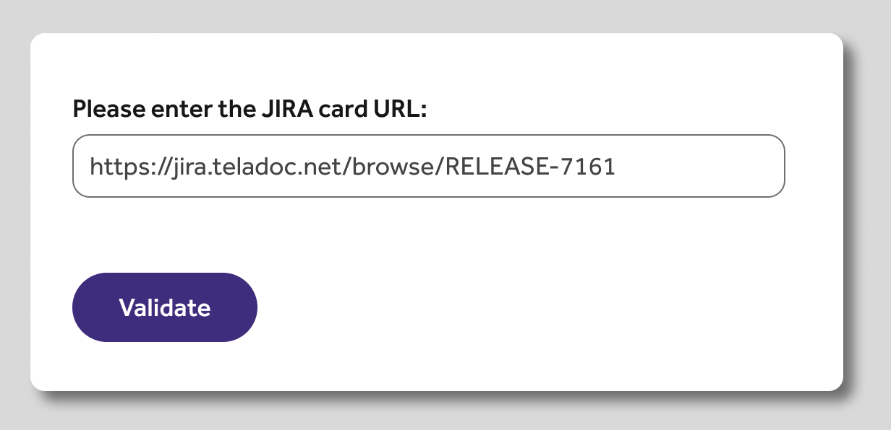
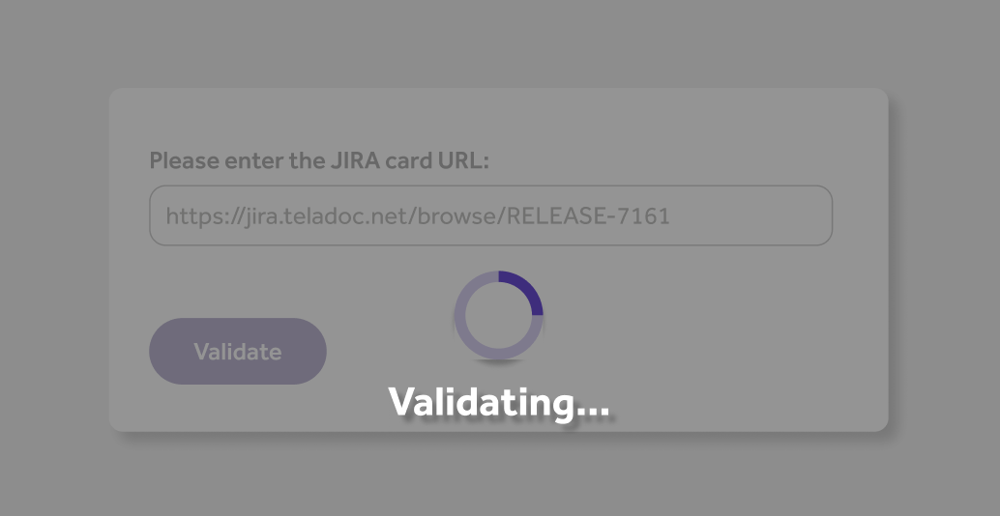
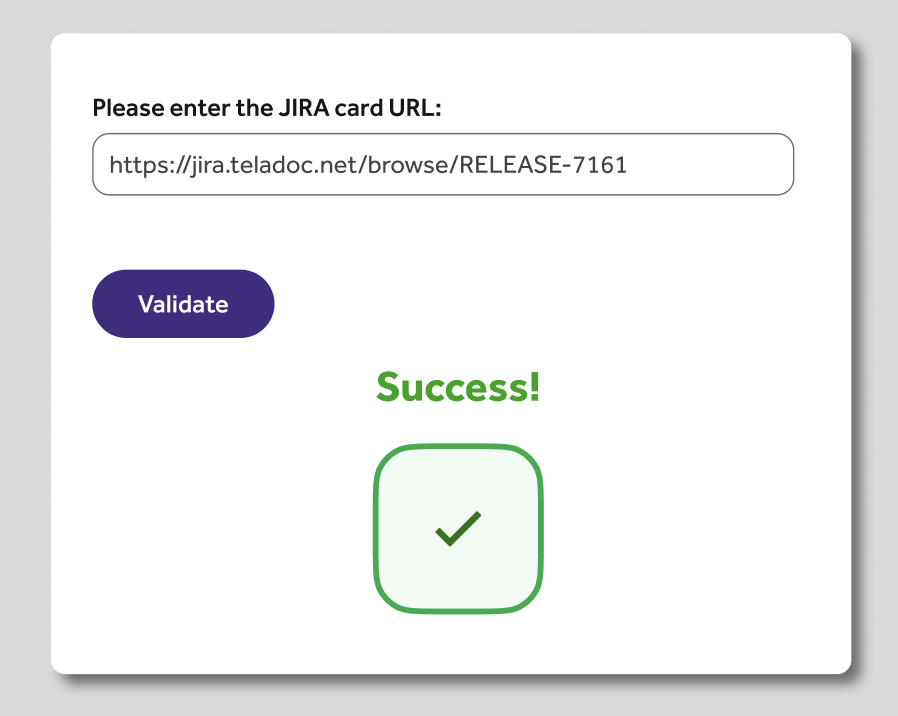
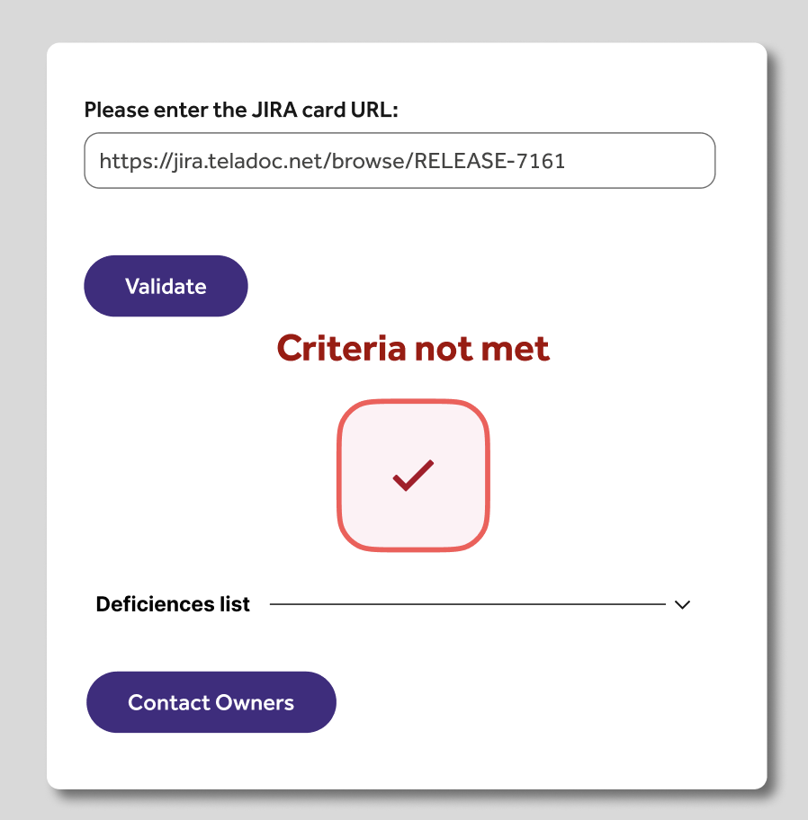

# Wintership 2023 Front End engineering
The product manager has tasked you with implementing these features for the Release Card Validator app. The following five features need to be completed in the next sprint. A portion of the code with basic functionalities has already been created.

## Feature #1
### Description
Users should be able to enter the URL for a Jira Ticket and click on a botton to retrieve it's information. The page should be able to make a Fetch call to the Jira API to retrieve the release card fields to later validation. Check useful links at the bottom.

### Requirements
Implement all the needed components to make the call to the Jira API and retrieve the card details. Make all the test cases needed and consider possible failures in the API call and display the appropriate message errors.

## Feature #2
### Description
The web application should be able to validate these fields present in the Jira release card. Release approvers usually need to review the release card by inspecting a few mandatory fields. If validation fails due to incomplete release care, the release requestor must update the fields and raise requests to rerelease approvers.

### Requirements
Jira release cards will typically have many fields. Take a look at this example https://jira.teladoc.net/browse/RELEASE-7161 for a sample release request. Please ensure the following fields are not empty and display the validation results.
Fields: title, description, Change Start, Change completion date, Communication Plan, Deployment Plan, Post Deployment Verification Plan
Make sure to add the appropriate tests and test all the code added.

## Feature #3
### Description
Authentication is a critical requirement of almost any application. At the same time, there are many ways authentication could be achieved. We often need a fine-grained permissions model to allow only specific users to access certain resources while restricting access to everyone else.

### Requirements
Build authentication capability using firebase authentication service.

## Feature #4
### Description
As the output of feature #2, you will have the working capability that validates the release card. The validation results can be emailed to the release requestors to update the release and retry.

### Requirements
As part of Feature#5, the "Contact to requestors" will be added. The results will be shared with requestors through email. The email capability needs to be developed using provider Maropost. 

## Feature #5
### Description
The following screens are mockups for the look and feel of the page to be created. Please stick to all the basic functionalities but feel free to improve them as you see fit.

### Requirements
Follow these example screens for the look and feel. Add any aditional one you consider it's needed or could improve the user experience (for example, error message).

## Useful Links
Official React documentation:
https://reactjs.org/docs/getting-started.html
https://beta.reactjs.org/

Consume API:
https://developer.mozilla.org/en-US/docs/Web/API/Request
https://www.freecodecamp.org/news/how-to-consume-rest-apis-in-react/

React + Typescript:
https://www.typescriptlang.org/docs/
https://www.typescriptlang.org/docs/handbook/react.html
https://github.com/typescript-cheatsheets/react#reacttypescript-cheatsheets

## Directions

## Extra Credit

## Submission
